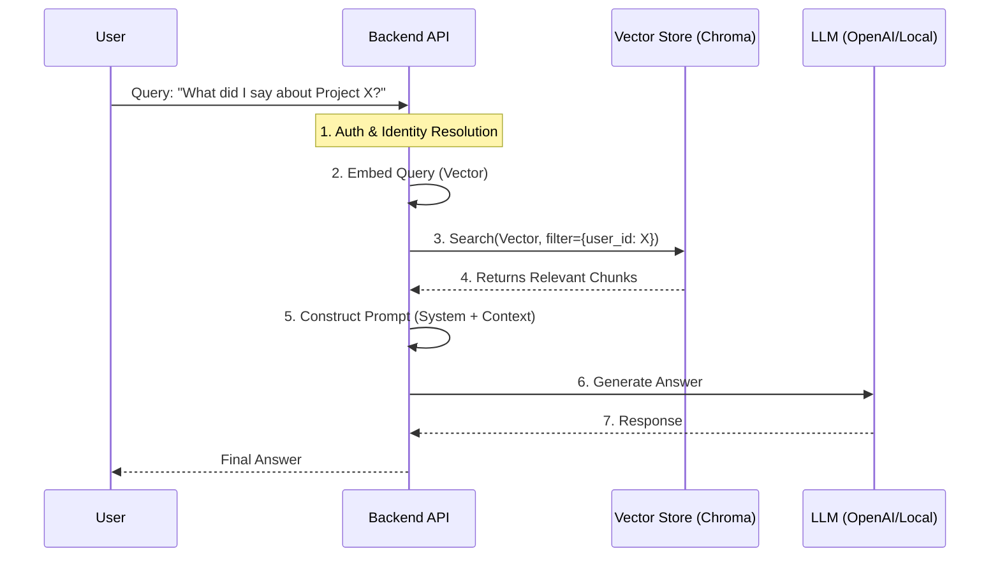

# 🛡️ Recall AI — RAG Pipeline & Privacy Protocol

## 1. Retrieval-Augmented Generation (RAG) Pipeline

The RAG pipeline bridges strict data isolation with Generative AI.



### Step-by-Step Flow
1.  **Intent Analysis**: (Optional) Classify if the query requires retrieval or is just chat.
2.  **Strict Retrieval**: We query the Vector DB using the embedding of the user's question. **Crucially**, we apply `where user_id = current_user.id`. This ensures zero data leakage between users.
3.  **Context Assembly**: We take the top $K$ (e.g., 5) chunks.
4.  **Prompt Construction**: We wrap the context in a template that forces the LLM to ignore outside knowledge.

---

## 2. Prompt Engineering Strategy

To prevent hallucinations and enforce strict grounding, we use the following prompt template:

```text
SYSTEM: You are Recall AI, a private memory assistant.
You answer questions ONLY based on the provided Context.
If the answer is not in the Context, say "I don't recall that information."
Do not make up facts.

CONTEXT:
---
[Date: 2023-10-12] Project X deadline pushed to Q4.
---
[Date: 2023-10-15] Discussed Project X with Sarah. decided to use Python.
---

USER QUERY: {user_query}

ANSWER:
```

**Key Mechanisms:**
*   **Negative Constraint**: Explicitly telling the model *what not to do* (make up facts).
*   **Source citations**: We can append `[Doc ID]` to every chunk in the prompt and ask the LLM to cite them.

---

## 3. Privacy & Data Deletion (GDPR/CCPA)

### **Inference Privacy**
*   **Anonymization**: Before sending data to an external LLM (like OpenAI), we can run a PII scrubber (e.g., Presidio) to mask names/emails if required only for the LLM step.
*   **Zero Retention**: If using external APIs, we opt-out of training (e.g., OpenAI Zero Data Retention policy).
*   **Local LLM Option**: For maximum privacy, deploy Llama-3 or Mistral locally alongside the backend.

### **Data Deletion Strategy**
1.  **Right to Erasure**:
    *   Endpoint: `DELETE /documents/{id}`
    *   Action: 
        1.  Delete row from PostgreSQL (`DELETE FROM documents WHERE id=X AND user_id=Y`).
        2.  Delete vectors from Chroma (`collection.delete(where={"$and": [{"doc_id": X}, {"user_id": Y}]})`).
    *   **Verification**: The system returns a 204 No Content only after both confirm deletion.
2.  **Account Nuke**:
    *   Iterate all documents for `user_id` and perform the above.

---

## 4. Logging & Monitoring

**Principle**: Never log content. Log metadata.

*   **Bad Log**: `logger.info(f"User asked: {query} and we found: {chunks}")` **(ILLEGAL)**
*   **Good Log**: `logger.info(f"User {user_hash} query processed. Retrieved {count} chunks. Latency: 200ms")`

We use **Structured Logging** (JSON) to track system health (latency, error rates, retrieval recall k-means) without inspecting user thoughts.

---

## 5. Future Extensions

*   **Voice Ingestion**: Add `POST /ingest/audio` using OpenAI Whisper to transcribe -> chunk -> embed.
*   **Wearable Sync**: Bluetooth sync from hardware to Mobile App -> API.
*   **Streaming**: Use Server-Sent Events (SSE) for the RAG generation step to reduce perceived latency.
